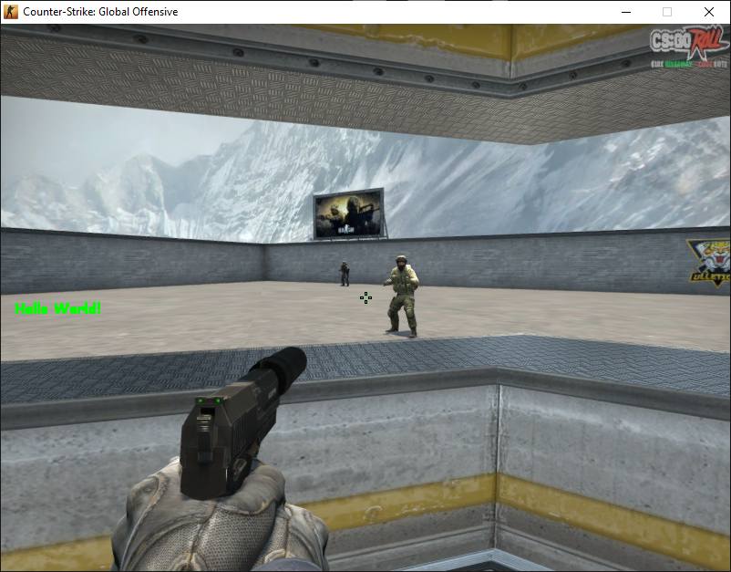

# DirectX9Overlay
A library that lets you draw on top of a DirectX 9 window, perfect for internal CSGO cheats.

# Usage
Call the constructor of `DirectX9Overlay` in your main function with the window name and references to the render function and the cleanup function.

# Example

  [Example for CSGO](DirectX9Overlay/example/dllmain.cpp)
    
  

